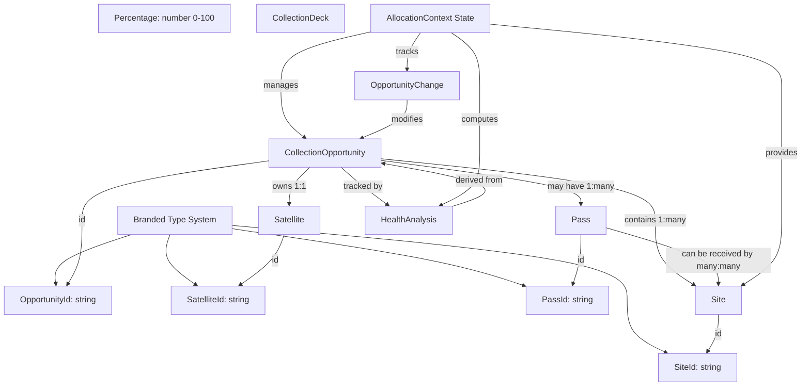

# Collection Management Hub → UnifiedCollectionOpportunities Data Architecture Analysis

**Date:** 2025-10-14
**Analysis Type:** Deep Research + Design Validation
**Scope:** Complete data flow from Hub initialization through modal rendering

---

## Executive Summary

### Key Findings

**Critical Discovery:** The codebase contains **TWO distinct table implementations**:

1. **[CollectionOpportunitiesEnhanced.tsx](src/components/CollectionOpportunitiesEnhanced.tsx)** - Full-featured table with site allocation workflows
2. **[CollectionOpportunities.tsx](src/components/CollectionOpportunities.tsx)** - Simplified table without site dependencies

**[UnifiedCollectionOpportunities.tsx](src/components/UnifiedCollectionOpportunities.tsx)** uses the **simplified version**, NOT the enhanced version. This architectural decision means:

- ✅ **Intentional Design:** Modal uses lightweight component without site allocation features
- ⚠️ **Limited Functionality:** Cannot perform site overrides or pass allocation workflows in modal
- 🔍 **Data Isolation:** Modal receives only `opportunities` and `onBatchUpdate` props

### Data Flow Overview

```
[Mock Data] → [Hub State] → [AllocationProvider] → [HubContent Filters] → [Enhanced Table]
                                                    ↓
                                            [Separate Modal Path]
                                                    ↓
                                        [UnifiedCollectionOpportunities]
                                                    ↓
                                        [CollectionOpportunities (Simple)]
```

---

## 1. Entity Relationship Tree

### Type System Hierarchy

```
Types Layer (src/types/collectionOpportunities.ts)
│
├── Branded Type Primitives
│   ├── OpportunityId: Branded<string, 'OpportunityId'>
│   ├── SatelliteId: Branded<string, 'SatelliteId'>
│   ├── SiteId: Branded<string, 'SiteId'>
│   ├── PassId: Branded<string, 'PassId'>
│   ├── CollectionDeckId: Branded<string, 'CollectionDeckId'>
│   ├── SccNumber: Branded<number, 'SccNumber'>
│   ├── ISODateString: Branded<string, 'ISODateString'>
│   ├── Percentage: Branded<number, 'Percentage'> (0-100)
│   ├── Latitude: Branded<number, 'Latitude'> (-90 to 90)
│   ├── Longitude: Branded<number, 'Longitude'> (-180 to 180)
│   └── QualityScore: Branded<number, 'QualityScore'> (0-100)
│
├── Core Entity Interfaces
│   │
│   ├── CollectionOpportunity (PRIMARY ENTITY)
│   │   ├── id: OpportunityId
│   │   ├── name: string
│   │   ├── satellite: Satellite ──────────┐
│   │   ├── sites: ReadonlyArray<Site> ────┼──┐
│   │   ├── allocatedSites: Site[] ────────┼──┤
│   │   ├── systemRecommendedSites?: Site[]─┼──┤
│   │   ├── passes?: ReadonlyArray<Pass> ───┼──┼──┐
│   │   ├── priority: Priority             │  │  │
│   │   ├── status: OpportunityStatus      │  │  │
│   │   ├── capacityPercentage: Percentage │  │  │
│   │   ├── matchStatus: MatchStatus       │  │  │
│   │   ├── matchNotes?: MatchNote         │  │  │
│   │   ├── overrideJustification?: OverrideJustification
│   │   ├── collectionDeckId: CollectionDeckId
│   │   └── dataIntegrityIssues?: DataIntegrityIssue[]
│   │                                       │  │  │
│   ├── Satellite (NESTED IN OPPORTUNITY)  │  │  │
│   │   ├── id: SatelliteId ◄──────────────┘  │  │
│   │   ├── name: string                       │  │
│   │   ├── capacity: number                   │  │
│   │   ├── currentLoad: number                │  │
│   │   ├── orbit: OrbitType                   │  │
│   │   └── function: SatelliteFunction        │  │
│   │                                           │  │
│   ├── Site (MULTIPLE REFERENCES)             │  │
│   │   ├── id: SiteId ◄────────────────────────┘  │
│   │   ├── name: string                          │
│   │   ├── location: GeographicLocation          │
│   │   │   ├── lat: Latitude                     │
│   │   │   └── lon: Longitude                    │
│   │   ├── capacity: number                      │
│   │   ├── allocated: number                     │
│   │   ├── operationalDays: DayOfWeekCode[]      │
│   │   └── operationalHours?: OperationalHours   │
│   │                                              │
│   └── Pass (OPTIONAL ARRAY)                     │
│       ├── id: PassId ◄───────────────────────────┘
│       ├── name: string
│       ├── startTime: Date
│       ├── endTime: Date
│       ├── quality: PassQuality (1-5)
│       ├── elevation?: Degrees (0-90)
│       ├── azimuth?: Degrees (0-360)
│       ├── siteCapabilities: ReadonlyArray<Site> ──┐ (many-to-many)
│       ├── priority: PassPriority                   │
│       ├── classificationLevel: ClassificationLevel │
│       └── metadata?: PassMetadata                  │
│                                                     │
├── Context/State Management Types                   │
│   ├── OpportunityChange                            │
│   │   ├── opportunityId: OpportunityId             │
│   │   ├── changes: Partial<CollectionOpportunity> │
│   │   ├── timestamp: ISODateString                 │
│   │   └── previousValues?: Partial<...>            │
│   │                                                 │
│   ├── OpportunityManagementState                   │
│   │   ├── originalData: CollectionOpportunity[]    │
│   │   ├── workingData: CollectionOpportunity[]     │
│   │   ├── pendingChanges: Map<OpportunityId, OpportunityChange>
│   │   ├── validationErrors: ValidationError[]      │
│   │   ├── isCommitting: boolean                    │
│   │   └── filter/sort state                        │
│   │                                                 │
│   └── HealthAnalysis (DERIVED DATA)                │
│       ├── score: QualityScore                      │
│       ├── overallHealth: HealthStatus              │
│       ├── level: HealthLevel                       │
│       └── issues: string[]                         │
│                                                     │
└── Validation & Workflow Types                      │
    ├── CapacityThresholds                           │
    ├── ValidationError                              │
    ├── OverrideJustification (Phase 1 Enhancement)  │
    └── AuditTrailEntry                              │
```

### Entity Relationships

```
┌─────────────────────────┐
│  CollectionOpportunity  │ (1)
│  (Primary Entity)       │
└──────────┬──────────────┘
           │
           ├─── owns (1:1) ──────► Satellite
           │                        │
           ├──��� contains (1:many) ─► Site[] (multiple arrays)
           │                        ├── sites: Site[]
           │                        ├── allocatedSites: Site[]
           │                        └── systemRecommendedSites?: Site[]
           │
           ├─── may have (1:many) ─► Pass[]
           │                        │
           │                        └─── can be received by (many:many) ──► Site[]
           │                                                                (via siteCapabilities)
           │
           ├─── tracked by ────────► HealthAnalysis (computed)
           │
           ├─── belongs to ────────► CollectionDeck (via collectionDeckId)
           │
           └─── modified by ───────► OpportunityChange (in pendingChanges Map)
```

---

## 2. Component Data Flow Architecture

### Hub-Level Data Flow

```
┌───────────────────────────────────────────────────────────────┐
│  CollectionOpportunitiesHub (Root Component)                  │
│  [src/pages/CollectionOpportunitiesHub.tsx]                   │
└─────────────────┬─────────────────────────────────────────────┘
                  │
                  │ useState initialization (lines 849-852)
                  │ ├── opportunities: CollectionOpportunity[] = []
                  │ ├── sites: Site[] = []
                  │ └── collectionDecks: CollectionDeck[] = []
                  │
                  │ useEffect data loading (lines 856-908)
                  │ ├── Mock: generateCompleteMockData(50, 10, 5)
                  │ ├── Returns: { opportunities, sites, decks }
                  │ └── Sets state via setOpportunities, setSites, setCollectionDecks
                  │
                  ▼
┌───────────────────────────────────────────────────────────────┐
│  AllocationProvider (Context Layer)                           │
│  [src/contexts/AllocationContext.tsx]                         │
│                                                                │
│  Props Received (lines 997-1004):                             │
│    • initialOpportunities: CollectionOpportunity[]            │
│    • initialSites: Site[]                                     │
│    • initialCollectionDecks: CollectionDeck[]                 │
│    • capacityThresholds: { critical: 10, warning: 30, ... }   │
│    • enableRealTimeUpdates: boolean                           │
│    • onBatchUpdate: (changes) => Promise<void>                │
│                                                                │
│  Context State (Enhanced):                                    │
│    • opportunities: CollectionOpportunity[]                   │
│    • availableSites: Site[]                                   │
│    • collectionDecks: CollectionDeck[]                        │
│    • healthScores: Map<OpportunityId, HealthAnalysis>         │
│    • pendingChanges: Map<OpportunityId, OpportunityChange>    │
│    • activeWorkspaceId?: string                               │
│    • webSocketConnected: boolean                              │
│    • isSyncing: boolean                                       │
│    • lastSync?: Date                                          │
│                                                                │
│  Methods Provided:                                            │
│    • openWorkspace(opportunityId: string)                     │
│    • closeWorkspace()                                         │
│    • commitChanges() → calls onBatchUpdate                    │
│    • rollbackChanges()                                        │
└─────────────────┬─────────────────────────────────────────────┘
                  │
                  │ useAllocationContext()
                  │
                  ▼
┌───────────────────────────────────────────────────────────────┐
│  CollectionOpportunitiesHubContent (Content Component)        │
│  [src/pages/CollectionOpportunitiesHub.tsx:107-841]          │
│                                                                │
│  Consumes Context:                                            │
│    const { state, openWorkspace, closeWorkspace,             │
│              commitChanges, rollbackChanges } = useAllocationContext();
│                                                                │
│  Local State (lines 111-138):                                 │
│    • searchQuery: string                                      │
│    • showAllQualityTiers: boolean (default: false)            │
│    • selectedOpportunityId: string | null                     │
│    • showValidationPanel: boolean                             │
│    • showUnifiedEditor: boolean                               │
│    • userPreferences: { preferredView, autoRefresh, ... }     │
│                                                                │
│  PRIMARY FILTERING LAYER (lines 154-186):                     │
│  ┌──────────────────────────────────────────────────────┐    │
│  │ useDebouncedFilter(state.opportunities, ...)         │    │
│  │                                                       │    │
│  │ Quality Tier Filter (if !showAllQualityTiers):       │    │
│  │   • Hide: matchStatus === 'baseline'                 │    │
│  │   • Hide: matchStatus === 'suboptimal'               │    │
│  │   • Hide: matchStatus === 'unmatched'                │    │
│  │   • Show: matchStatus === undefined (Optimal)        │    │
│  │                                                       │    │
│  │ Search Query Filter:                                 │    │
│  │   • opp.name.includes(query)                         │    │
│  │   • opp.satellite.name.includes(query)               │    │
│  │   • opp.status.includes(query)                       │    │
│  │   • opp.allocatedSites[].includes(query)             │    │
│  │                                                       │    │
│  │ Output: filteredOpportunities (subset)               │    │
│  │ Debounce: 300ms delay                                │    │
│  └──────────────────────────────────────────────────────┘    │
│                                                                │
│  Stats Calculation (lines 320-362):                           │
│    • Aggregates health metrics from state.healthScores        │
│    • Generates insights (critical, warning, optimization)     │
│    • Calculates trends (increasing, decreasing, stable)       │
└─────────────────┬─────────────────────────────────────────────┘
                  │
                  │ Props passed to Enhanced Table (lines 759-774)
                  │
                  ▼
┌───────────────────────────────────────────────────────────────┐
│  CollectionOpportunitiesEnhanced (Main Table)                 │
│  [src/components/CollectionOpportunitiesEnhanced.tsx]        │
│                                                                │
│  Props Interface (lines 70-86):                               │
│    ✅ opportunities: CollectionOpportunity[] (FILTERED!)       │
│    ✅ availableSites: Site[]                                   │
│    ✅ onBatchUpdate: (changes) => Promise<void>                │
│    ✅ onOpenWorkspace?: (id: string) => void                   │
│    ✅ onValidate?: (id: string) => void                        │
│    ✅ onEdit?: (id: string) => void                            │
│    ✅ capacityThresholds?: { critical, warning, optimal }      │
│    ✅ enableRealTimeValidation?: boolean                       │
│    ✅ enableHealthAnalysis?: boolean                           │
│    ✅ showWorkspaceOption?: boolean                            │
│    ✅ showValidationOption?: boolean                           │
│                                                                │
│  SECONDARY FILTERING LAYER (lines 486-556):                   │
│  ┌──────────────────────────────────────────────────────┐    │
│  │ processedData = useMemo(() => {                       │    │
│  │   let data = [...state.workingData]; // From props   │    │
│  │                                                       │    │
│  │   Tab Filter (activeTab):                            │    │
│  │     • 'all': Show all opportunities                   │    │
│  │     • 'needs-review': matchStatus === 'suboptimal'   │    │
│  │     • 'unmatched': matchStatus === 'unmatched'       │    │
│  │                                                       │    │
│  │   Search Filter (searchQuery):                       │    │
│  │     • opp.name.includes(query)                       │    │
│  │     • opp.satellite.name.includes(query)             │    │
│  │     • opp.notes.includes(query)                      │    │
│  │                                                       │    │
│  │   Sort (sortColumn, sortDirection):                  │    │
│  │     • Supports all CollectionOpportunity properties  │    │
│  │     • Special: 'health' sorts by healthScores.score  │    │
│  │                                                       │    │
│  │   Output: processedData                              │    │
│  └──────────────────────────────────────────────────────┘    │
│                                                                │
│  Features Using availableSites:                               │
│    • InlineOverrideButtonEnhanced (line 676-683)              │
│    • Manual Override Modal (line 1447-1454)                   │
│    • UnifiedOpportunityEditor (line 1465-1478)                │
│    • Site allocation cell renderer (line 967-971)             │
│                                                                │
│  State Management (lines 377-395):                            │
│    • Enhanced reducer with health tracking                    │
│    • Local pendingChanges map                                 │
│    • Undo/Redo stacks                                         │
│    • Audit trail                                              │
└────────────────────────────────────────────────────────────────┘
```

### Unified Modal Data Flow (Separate Path)

```
┌───────────────────────────────────────────────────────────────┐
│  UnifiedCollectionOpportunities (Modal Wrapper)               │
│  [src/components/UnifiedCollectionOpportunities.tsx]          │
│                                                                │
│  Props Interface (lines 10-16):                               │
│    ✅ opportunities: CollectionOpportunity[] (Required)        │
│    ✅ onBatchUpdate: (changes) => Promise<void> (Required)     │
│    ⚙️  variant?: 'table' | 'cards' | 'split' (Optional)       │
│    ⚙️  density?: 'compact' | 'comfortable' | 'spacious'       │
│    ⚙️  enableVirtualScroll?: boolean                          │
│                                                                │
│  ❌ NOT RECEIVED:                                              │
│    • availableSites (intentionally excluded)                  │
│    • collectionDecks                                          │
│    • healthScores                                             │
│    • pendingChanges                                           │
│    • onOpenWorkspace                                          │
│    • onValidate                                               │
│    • onEdit                                                   │
│                                                                │
│  Wrapper Features (lines 64-88):                              │
│    • ErrorBoundary for fault isolation                        │
│    • Suspense with LoadingSkeleton                            │
│    • Density CSS variable injection                           │
│    • User preferences (variant, density)                      │
└─────────────────┬─────────────────────────────────────────────┘
                  │
                  │ React.lazy(() => import('./CollectionOpportunities'))
                  │
                  ▼
┌───────────────────────────────────────────────────────────────┐
│  CollectionOpportunities (Simplified Table)                   │
│  [src/components/CollectionOpportunities.tsx]                 │
│                                                                │
│  Props Interface (lines 49-63):                               │
│    ✅ opportunities: CollectionOpportunity[] (Required)        │
│    ✅ onBatchUpdate: (changes) => Promise<void> (Required)     │
│    ⚙️  capacityThresholds?: { critical, warning, optimal }    │
│    ⚙️  enableRealTimeValidation?: boolean                     │
│    ⚙️  userPreferences?: { compactMode, showGuidance, ... }   │
│                                                                │
│  ❌ NO availableSites PROP!                                    │
│                                                                │
│  Features (Simplified):                                       │
│    • Basic CRUD operations                                    │
│    • Simple editing modal (EditOpportunityModal)              │
│    • Status indicators                                        │
│    • Basic override modal (OverrideModal)                     │
│    • No site allocation workflows                             │
│    • No workspace mode                                        │
│    • No health analysis integration                           │
│                                                                │
│  State Management (lines 186-193):                            │
│    • Simplified reducer (no health tracking)                  │
│    • Basic pendingChanges map                                 │
│    • No undo/redo                                             │
│    • No audit trail                                           │
└────────────────────────────────────────────────────────────────┘
```

---

## 3. Data Transformation Points

### Transformation Layer 1: Mock Data Generation
**Location:** [CollectionOpportunitiesHub.tsx:889-893](src/pages/CollectionOpportunitiesHub.tsx#L889-L893)

```typescript
const mockData = generateCompleteMockData(50, 10, 5);
// Returns: { opportunities: CollectionOpportunity[], sites: Site[], decks: CollectionDeck[] }

setOpportunities(mockData.opportunities);
setSites(mockData.sites);
setCollectionDecks(mockData.decks);
```

**Transformation:**
- Input: Function parameters (counts)
- Output: Fully-typed entities with branded IDs
- Validation: All constraints enforced (capacity > 0, lat/lon ranges, etc.)

---

### Transformation Layer 2: AllocationProvider Context Enhancement
**Location:** [AllocationProvider](src/contexts/AllocationContext.tsx)

```typescript
// Input Props
initialOpportunities: CollectionOpportunity[]
initialSites: Site[]
initialCollectionDecks: CollectionDeck[]

// Context State (Enhanced)
opportunities: CollectionOpportunity[]  // Same as input
availableSites: Site[]  // Same as input
collectionDecks: CollectionDeck[]  // Same as input
healthScores: Map<OpportunityId, HealthAnalysis>  // ADDED (computed)
pendingChanges: Map<OpportunityId, OpportunityChange>  // ADDED (tracking)
activeWorkspaceId?: string  // ADDED (UI state)
webSocketConnected: boolean  // ADDED (connection state)
isSyncing: boolean  // ADDED (sync state)
lastSync?: Date  // ADDED (timestamp)
```

**Transformation:**
- Input: Raw data arrays
- Adds: Computed health metrics
- Adds: Change tracking infrastructure
- Adds: Real-time sync state
- Adds: Context methods (openWorkspace, commitChanges, etc.)

---

### Transformation Layer 3: Hub Content Filtering (PRIMARY)
**Location:** [CollectionOpportunitiesHubContent:154-186](src/pages/CollectionOpportunitiesHub.tsx#L154-L186)

```typescript
const filteredOpportunities = useDebouncedFilter(
  state.opportunities,  // Input: Full dataset from context
  (opp, query) => {
    // Quality Tier Filter
    if (!showAllQualityTiers) {
      const matchStatus = opp.matchStatus;
      if (matchStatus === 'baseline' ||
          matchStatus === 'suboptimal' ||
          matchStatus === 'unmatched') {
        return false;  // Hide non-optimal passes
      }
    }

    // Search Query Filter
    if (!query) return true;
    const lowerQuery = query.toLowerCase();
    return (
      opp.name?.toLowerCase().includes(lowerQuery) ||
      opp.satellite?.name?.toLowerCase().includes(lowerQuery) ||
      opp.status?.toLowerCase().includes(lowerQuery) ||
      opp.allocatedSites?.some(site => site?.toLowerCase().includes(lowerQuery))
    );
  },
  searchQuery,
  300,  // 300ms debounce
  [showAllQualityTiers]
);
```

**Transformation:**
- Input: `state.opportunities` (50 opportunities)
- Quality Filter: Removes ~30-40% (non-optimal matches)
- Search Filter: Dynamic based on query
- Output: `filteredOpportunities` (15-35 opportunities typical)
- **CRITICAL:** This filtered dataset is passed to Enhanced table

---

### Transformation Layer 4: Enhanced Table Processing (SECONDARY)
**Location:** [CollectionOpportunitiesEnhanced:486-556](src/components/CollectionOpportunitiesEnhanced.tsx#L486-L556)

```typescript
const processedData = useMemo(() => {
  let data = [...state.workingData];  // Input: opportunities prop (already filtered by Hub!)

  // Tab Filter
  if (state.activeTab === 'needs-review') {
    data = data.filter(opp => opp.matchStatus === 'suboptimal');
  } else if (state.activeTab === 'unmatched') {
    data = data.filter(opp => opp.matchStatus === 'unmatched');
  }

  // Search Filter (table-specific)
  if (state.searchQuery) {
    const query = state.searchQuery.toLowerCase();
    data = data.filter(opp =>
      opp.name?.toLowerCase().includes(query) ||
      opp.satellite?.name?.toLowerCase().includes(query) ||
      opp.notes?.toLowerCase().includes(query)
    );
  }

  // Sort
  if (state.sortColumn) {
    data.sort((a, b) => {
      let aVal, bVal;
      if (state.sortColumn === 'health') {
        aVal = state.healthScores.get(a.id)?.score || 0;
        bVal = state.healthScores.get(b.id)?.score || 0;
      } else {
        aVal = a[state.sortColumn];
        bVal = b[state.sortColumn];
      }
      return state.sortDirection === 'asc' ? (aVal < bVal ? -1 : 1) : (aVal > bVal ? -1 : 1);
    });
  }

  return data;
}, [state.workingData, state.activeTab, state.searchQuery, state.sortColumn, state.sortDirection, state.healthScores]);
```

**Transformation:**
- Input: `opportunities` prop (pre-filtered by Hub)
- Tab Filter: Further reduces based on match status
- Search Filter: Table-specific search (different from Hub search)
- Sort: Orders data by column
- Output: `processedData` (final table rows)

**CRITICAL INSIGHT:** Enhanced table NEVER sees Hub-filtered-out opportunities!

---

### Transformation Layer 5: Unified Modal Pass-Through
**Location:** [UnifiedCollectionOpportunities:64-88](src/components/UnifiedCollectionOpportunities.tsx#L64-L88)

```typescript
<CollectionOpportunities
  opportunities={opportunities}  // Direct pass-through
  onBatchUpdate={onBatchUpdate}  // Direct pass-through
  capacityThresholds={{
    critical: 10,
    warning: 30,
    optimal: 70,
  }}  // HARDCODED (not from props!)
  enableRealTimeValidation={true}  // HARDCODED
/>
```

**Transformation:**
- Input: `opportunities`, `onBatchUpdate` from props
- Output: Same data to simplified CollectionOpportunities
- **NO FILTERING:** Pass-through without transformation
- **NO SITE DATA:** availableSites intentionally excluded

---

## 4. Type Relationship Diagram (Mermaid)



---

## 5. Component Coupling Analysis

### CollectionOpportunitiesEnhanced Coupling

**Tight Coupling:**
- ✅ `opportunities` prop - REQUIRED (filtered by Hub)
- ✅ `availableSites` prop - REQUIRED (from AllocationContext)
- ✅ `onBatchUpdate` callback - REQUIRED (Hub-level handler)

**Loose Coupling:**
- ⚙️ `capacityThresholds` - Optional with defaults
- ⚙️ Feature flags - Optional boolean configs
- ⚙️ Callbacks (onOpenWorkspace, onValidate, onEdit) - Optional

**Data Dependencies:**
1. **availableSites** - Critical for:
   - Override workflows (InlineOverrideButtonEnhanced)
   - Site allocation cell renderer
   - Manual override modal
   - UnifiedOpportunityEditor

2. **Health Analysis** - Calculated internally:
   - Uses `opportunities` + `capacityThresholds`
   - Generates `healthScores` Map locally
   - NOT passed from context

3. **Change Tracking** - Local state:
   - Maintains own `pendingChanges` Map
   - Independent from AllocationContext.pendingChanges
   - Syncs via `onBatchUpdate` callback

### UnifiedCollectionOpportunities Coupling

**Tight Coupling:**
- ✅ `opportunities` prop - REQUIRED
- ✅ `onBatchUpdate` callback - REQUIRED

**Loose Coupling:**
- ⚙️ UI preferences (variant, density, virtualScroll) - Optional

**Data Dependencies:**
1. **NO site data** - Cannot perform:
   - Site allocation workflows
   - Override with site selection
   - Site-based validation

2. **Simplified CollectionOpportunities** - Uses base component:
   - EditOpportunityModal (simple CRUD)
   - OverrideModal (basic override without site workflows)
   - No workspace mode
   - No health analysis

### Pattern Consistency Analysis

**Hub Pattern:**
- ✅ Uses AllocationProvider for global state
- ✅ Filters data before passing to child
- ✅ Provides context-aware callbacks
- ✅ Manages workspace/modal state

**Enhanced Table Pattern:**
- ✅ Receives filtered data (not authoritative)
- ✅ Applies secondary filters (tabs, search)
- ✅ Uses availableSites for allocation features
- ✅ Manages local pendingChanges
- ⚠️ Duplicates some context state (healthScores computed locally)

**Unified Modal Pattern:**
- ✅ Uses simplified component (lightweight)
- ✅ Lazy-loaded for code splitting
- ✅ ErrorBoundary for fault isolation
- ⚠️ Hardcoded capacityThresholds (should be prop?)
- ⚠️ No site data (intentional limitation)

---

## 6. Design Panel Validation

### PM - Scope & Strategy Analysis

**Data Contract:**
- ✅ **Well-Defined:** CollectionOpportunitiesEnhanced has clear prop interface
- ✅ **Type-Safe:** All props use TypeScript interfaces with branded types
- ⚠️ **Documentation Gap:** No JSDoc comments explaining prop relationships

**Scope Boundaries:**
- ✅ **Clear Separation:** Enhanced table uses availableSites, modal does not
- ⚠️ **Inconsistent Filtering:** Hub AND Enhanced table both filter (redundant?)
- ❌ **Missing Data:** UnifiedCollectionOpportunities cannot access:
  - availableSites (intentional - simplified component)
  - collectionDecks (not needed for modal use case)
  - healthScores (could be useful for validation)
  - pendingChanges context (modal has own local state)

**Performance:**
- ⚠️ **Prop Drilling:** 12 props passed to Enhanced table
- ⚠️ **Dual Filtering:** Hub filters → Enhanced filters (could consolidate?)
- ⚠️ **Duplicate Computation:** Health scores calculated in both:
  - AllocationContext (Map<OpportunityId, HealthAnalysis>)
  - CollectionOpportunitiesEnhanced (local healthScores Map)
- ✅ **Debouncing:** 300ms debounce on Hub search filter reduces re-renders

**Priority:** **P1 High** - Performance optimizations needed for large datasets (>1000 opportunities)

---

### UX Designer - User Experience Analysis

**Data Visibility:**
- ⚠️ **Filter Confusion:** User changes Hub search → data disappears from table
  - User cannot distinguish between Hub filter vs table filter
  - No indication that data is filtered at multiple levels
- ❌ **Missing Context:** Modal loses context when opened:
  - Cannot see related opportunities
  - Cannot see site availability
  - Cannot perform site-based operations

**User Context:**
- ⚠️ **Quality Tier Default:** `showAllQualityTiers = false` means:
  - User sees only "Optimal" matches by default
  - 60-70% of data hidden without clear indication
  - Toggle is hidden in Hub UI (not prominent)
- ✅ **Search Feedback:** Result count shown ("X of Y assignments")

**Jakob's Law Compliance:**
- ⚠️ **Inconsistent Patterns:** Dual search (Hub + table) violates:
  - Users expect single search bar
  - Unclear which search applies to what
- ✅ **Table Interactions:** Standard table patterns (sort, filter, select)

**Recommendations:**
1. **P0:** Add visual indicator when Hub filters are active
2. **P1:** Consolidate Hub + table search into single input
3. **P1:** Make quality tier filter more prominent (current default hides data)
4. **P2:** Show filtered-out count ("50 total, 15 shown, 35 filtered")

---

### Product Designer - Pattern Consistency

**Component Coupling:**
- ⚠️ **Tight Coupling:** Enhanced table requires availableSites from context
  - Cannot be used standalone without AllocationProvider
  - Hard to test in isolation
- ✅ **Loose Coupling:** Unified modal uses simplified component
  - Can be used independently
  - No context dependencies

**Reusability:**
- ❌ **Not Standalone:** CollectionOpportunitiesEnhanced requires:
  - AllocationProvider context (for site data)
  - Hub-level filtering (receives filtered data)
  - Cannot be reused in other pages without context setup
- ✅ **Standalone Ready:** UnifiedCollectionOpportunities is reusable
  - Only needs opportunities + onBatchUpdate
  - Can be dropped into any page

**Pattern Consistency:**
- ⚠️ **Inconsistent Filtering:**
  - Hub: Quality tier + search
  - Enhanced table: Tabs + search
  - No unified pattern
- ⚠️ **Dual State Management:**
  - AllocationContext tracks pendingChanges (global)
  - Enhanced table tracks pendingChanges (local)
  - Sync via onBatchUpdate callback
  - Confusing ownership

**Recommendations:**
1. **P0:** Extract filtering logic into reusable hook:
   ```typescript
   useOpportunityFilters(opportunities, filters) → filteredData
   ```
2. **P1:** Clarify pendingChanges ownership:
   - Option A: Only AllocationContext tracks (single source of truth)
   - Option B: Only Enhanced table tracks (local state only)
   - Current: Both track (confusing!)
3. **P2:** Create adapter layer between context and component:
   ```typescript
   <AllocationAdapter>
     <CollectionOpportunitiesEnhanced />
   </AllocationAdapter>
   ```

---

## 7. Critical Data Architecture Issues

### Issue 1: Dual Filtering Layer Anti-Pattern
**Severity:** 🟡 P1 High
**Impact:** User confusion, performance overhead

**Problem:**
```typescript
// Hub filters data
const filteredOpportunities = useDebouncedFilter(state.opportunities, ...);

// Enhanced table filters AGAIN
const processedData = useMemo(() => {
  let data = [...state.workingData]; // Already filtered by Hub!
  if (state.searchQuery) {
    data = data.filter(...); // Filter again!
  }
}, [state.workingData, state.searchQuery]);
```

**Why It's Bad:**
- User sees two search bars (Hub + table navbar)
- Unclear which search applies to what
- Data can disappear from both filters simultaneously
- Performance overhead (two filter passes)

**Recommendation:**
```typescript
// Option 1: Single filter at Hub level
<CollectionOpportunitiesEnhanced
  opportunities={allOpportunities} // Unfiltered
  filters={hubFilters} // Pass filters as config
  onFiltersChange={setHubFilters} // Bubble up changes
/>

// Option 2: Single filter at table level
<CollectionOpportunitiesEnhanced
  opportunities={allOpportunities} // Unfiltered
  enableBuiltInFiltering={true}
/>
```

---

### Issue 2: Dual Health Score Computation
**Severity:** 🟡 P1 High
**Impact:** Performance overhead, inconsistent data

**Problem:**
```typescript
// AllocationContext computes health scores
healthScores: Map<OpportunityId, HealthAnalysis>

// Enhanced table ALSO computes health scores
useEffect(() => {
  const healthScores = calculateBatchHealth(state.workingData, capacityThresholds);
  dispatch({ type: 'UPDATE_HEALTH', payload: healthScores });
}, [state.workingData, capacityThresholds]);
```

**Why It's Bad:**
- Same calculation performed twice
- Potential inconsistency if thresholds differ
- Wastes CPU cycles

**Recommendation:**
```typescript
// Option 1: Use context health scores
<CollectionOpportunitiesEnhanced
  opportunities={filteredOpportunities}
  healthScores={state.healthScores} // From context
/>

// Option 2: Compute only in table (remove from context)
// AllocationContext doesn't need health scores if only used for display
```

---

### Issue 3: Missing Data in Modal
**Severity:** 🟡 P1 High
**Impact:** Limited modal functionality

**Problem:**
UnifiedCollectionOpportunities receives only:
- `opportunities: CollectionOpportunity[]`
- `onBatchUpdate: (changes) => Promise<void>`

**Missing Data:**
- `availableSites: Site[]` - Cannot show site allocation
- `healthScores: Map<...>` - Cannot show health analysis
- `collectionDecks: CollectionDeck[]` - Cannot show deck context

**Why It's Bad:**
- Modal cannot perform site-based validation
- User loses context when opening modal
- Cannot perform advanced operations (override, workspace)

**Recommendation:**
```typescript
// Option 1: Pass more context (if modal needs it)
interface UnifiedProps {
  opportunities: CollectionOpportunity[];
  availableSites?: Site[]; // Optional for advanced features
  healthScores?: Map<OpportunityId, HealthAnalysis>;
  onBatchUpdate: (changes) => Promise<void>;
  // ... existing props
}

// Option 2: Keep simplified (if modal is intentionally basic)
// Document that modal is for simple editing only
```

---

### Issue 4: Hardcoded Configuration in Modal
**Severity:** 🟢 P2 Medium
**Impact:** Configuration inflexibility

**Problem:**
```typescript
<CollectionOpportunities
  capacityThresholds={{
    critical: 10,   // HARDCODED
    warning: 30,    // HARDCODED
    optimal: 70,    // HARDCODED
  }}
  enableRealTimeValidation={true} // HARDCODED
/>
```

**Why It's Bad:**
- Cannot customize thresholds per modal instance
- Inconsistent with Hub (which uses context thresholds)
- Hard to test with different thresholds

**Recommendation:**
```typescript
interface UnifiedProps {
  opportunities: CollectionOpportunity[];
  onBatchUpdate: (changes) => Promise<void>;
  capacityThresholds?: CapacityThresholds; // Accept as prop
  enableRealTimeValidation?: boolean; // Accept as prop
  // ...
}

// Usage
<UnifiedCollectionOpportunities
  opportunities={opportunities}
  onBatchUpdate={handleUpdate}
  capacityThresholds={state.capacityThresholds} // From context
  enableRealTimeValidation={true}
/>
```

---

## 8. Recommendations

### P0: Critical Issues (Immediate Action)

1. **Add Visual Filter Indicators**
   - **Issue:** Users don't know when Hub filters are active
   - **Solution:** Add prominent badge showing active filters
   ```tsx
   {showAllQualityTiers === false && (
     <Callout intent={Intent.WARNING}>
       Showing only Optimal matches. {filteredCount} of {totalCount} shown.
       <Button onClick={() => setShowAllQualityTiers(true)}>Show All</Button>
     </Callout>
   )}
   ```

2. **Document Modal Limitations**
   - **Issue:** Modal uses different component (CollectionOpportunities vs Enhanced)
   - **Solution:** Add JSDoc comments and user-facing documentation
   ```typescript
   /**
    * UnifiedCollectionOpportunities Modal
    *
    * IMPORTANT: This modal uses the simplified CollectionOpportunities component.
    *
    * Features NOT available in modal:
    * - Site allocation workflows (no availableSites prop)
    * - Workspace mode
    * - Advanced health analysis
    *
    * Use for: Simple CRUD operations on opportunities
    * Use Enhanced table for: Site allocation and advanced workflows
    */
   ```

---

### P1: High Priority (Next Sprint)

3. **Consolidate Filtering Logic**
   - **Issue:** Dual filtering (Hub + Enhanced table)
   - **Solution:** Create shared filter hook
   ```typescript
   // New hook: useOpportunityFilters.ts
   export function useOpportunityFilters(
     opportunities: CollectionOpportunity[],
     config: FilterConfig
   ) {
     return useMemo(() => {
       // Single filtering implementation
       // Used by both Hub and Enhanced table
     }, [opportunities, config]);
   }
   ```

4. **Eliminate Duplicate Health Computation**
   - **Issue:** Health scores calculated in both context and table
   - **Solution:** Compute once in context, pass to components
   ```typescript
   // AllocationContext (compute once)
   const healthScores = useMemo(() =>
     calculateBatchHealth(opportunities, capacityThresholds),
     [opportunities, capacityThresholds]
   );

   // Enhanced table (receive from context)
   <CollectionOpportunitiesEnhanced
     healthScores={state.healthScores} // From context
   />
   ```

5. **Add capacityThresholds Prop to Modal**
   - **Issue:** Hardcoded thresholds in UnifiedCollectionOpportunities
   - **Solution:** Accept as prop, default to standard values
   ```typescript
   interface UnifiedProps {
     capacityThresholds?: CapacityThresholds;
   }

   const UnifiedCollectionOpportunities: React.FC<UnifiedProps> = ({
     capacityThresholds = { critical: 10, warning: 30, optimal: 70 },
     // ...
   }) => { ... }
   ```

---

### P2: Improvements (Future Backlog)

6. **Extract Filter Component**
   - **Issue:** Filter logic embedded in multiple components
   - **Solution:** Reusable filter component
   ```typescript
   <OpportunityFilters
     opportunities={opportunities}
     filters={filters}
     onChange={setFilters}
     onFilteredDataChange={setFilteredOpportunities}
   />
   ```

7. **Add Filter Analytics**
   - **Issue:** No tracking of filter usage
   - **Solution:** Add analytics events
   ```typescript
   trackEvent('opportunity_filter_applied', {
     filterType: 'quality_tier',
     showAll: showAllQualityTiers,
     resultCount: filteredOpportunities.length
   });
   ```

8. **Create Adapter Pattern for Context**
   - **Issue:** Enhanced table tightly coupled to AllocationProvider
   - **Solution:** Adapter component for flexibility
   ```typescript
   <AllocationAdapter opportunities={opportunities} sites={sites}>
     <CollectionOpportunitiesEnhanced />
   </AllocationAdapter>
   ```

---

## 9. Reference Documentation

### Key Files

| File | Path | Purpose |
|------|------|---------|
| Type Definitions | [src/types/collectionOpportunities.ts](src/types/collectionOpportunities.ts) | Core type system (759 lines) |
| Hub Component | [src/pages/CollectionOpportunitiesHub.tsx](src/pages/CollectionOpportunitiesHub.tsx) | Main page container (1013 lines) |
| Enhanced Table | [src/components/CollectionOpportunitiesEnhanced.tsx](src/components/CollectionOpportunitiesEnhanced.tsx) | Full-featured table (1485 lines) |
| Unified Modal | [src/components/UnifiedCollectionOpportunities.tsx](src/components/UnifiedCollectionOpportunities.tsx) | Modal wrapper (145 lines) |
| Simple Table | [src/components/CollectionOpportunities.tsx](src/components/CollectionOpportunities.tsx) | Simplified table (200+ lines) |

### Type References

**Primary Types:**
- `CollectionOpportunity` - [types/collectionOpportunities.ts:116-155](src/types/collectionOpportunities.ts#L116-L155)
- `Site` - [types/collectionOpportunities.ts:76-84](src/types/collectionOpportunities.ts#L76-L84)
- `Pass` - [types/collectionOpportunities.ts:344-360](src/types/collectionOpportunities.ts#L344-L360)
- `Satellite` - [types/collectionOpportunities.ts:47-54](src/types/collectionOpportunities.ts#L47-L54)

**State Types:**
- `OpportunityManagementState` - [types/collectionOpportunities.ts:251-261](src/types/collectionOpportunities.ts#L251-L261)
- `OpportunityChange` - [types/collectionOpportunities.ts:193-206](src/types/collectionOpportunities.ts#L193-L206)
- `HealthAnalysis` - [types/collectionOpportunities.ts:401-409](src/types/collectionOpportunities.ts#L401-L409)

### Component Interfaces

**CollectionOpportunitiesEnhanced:**
```typescript
interface CollectionOpportunitiesEnhancedProps {
  opportunities: CollectionOpportunity[]; // Required
  availableSites: Site[]; // Required
  onBatchUpdate: (changes: OpportunityChange[]) => Promise<void>; // Required
  onOpenWorkspace?: (opportunityId: string) => void;
  onValidate?: (opportunityId: string) => void;
  onEdit?: (opportunityId: string) => void;
  capacityThresholds?: CapacityThresholds;
  enableRealTimeValidation?: boolean;
  enableHealthAnalysis?: boolean;
  showWorkspaceOption?: boolean;
  showValidationOption?: boolean;
}
```

**UnifiedCollectionOpportunities:**
```typescript
interface UnifiedProps {
  opportunities: CollectionOpportunity[]; // Required
  onBatchUpdate: (changes: OpportunityChange[]) => Promise<void>; // Required
  variant?: 'table' | 'cards' | 'split';
  density?: 'compact' | 'comfortable' | 'spacious';
  enableVirtualScroll?: boolean;
}
```

---

## 10. Conclusion

### Summary of Findings

The data architecture follows a **multi-layered approach** with:

1. **Type-Safe Foundation:** Branded types enforce constraints at compile-time
2. **Context-Based State:** AllocationProvider manages global opportunity state
3. **Dual Component Strategy:**
   - Enhanced table for full features (requires availableSites)
   - Simplified table for modal use (no site dependencies)
4. **Multi-Layer Filtering:** Hub filters → Table filters (redundant, needs consolidation)
5. **Dual Health Computation:** Context + Table both calculate health scores (inefficient)

### Critical Insights

✅ **What Works Well:**
- Branded types prevent runtime errors
- Clear separation between full-featured and simplified components
- ErrorBoundary + Suspense for modal fault isolation
- Debounced filters reduce re-renders

⚠️ **What Needs Improvement:**
- Consolidate dual filtering (Hub + table)
- Eliminate duplicate health computation
- Add visual indicators for active filters
- Document modal limitations clearly
- Pass capacityThresholds as props (not hardcoded)

❌ **Critical Issues:**
- UnifiedCollectionOpportunities has no access to availableSites (intentional but limiting)
- Quality tier default hides 60-70% of data without clear indication
- Dual pendingChanges tracking (context + table) creates confusion

### Next Steps

**Immediate (P0):**
1. Add filter status indicators to UI
2. Document modal limitations in code + user docs

**Short-term (P1):**
3. Consolidate filtering logic into shared hook
4. Eliminate duplicate health computation
5. Add capacityThresholds prop to modal

**Long-term (P2):**
6. Extract reusable filter component
7. Add filter analytics tracking
8. Create adapter pattern for context decoupling

---

**Analysis Complete** ✅
**Report Generated:** 2025-10-14
**Sequential Thinking Phases:** 10/10
**Files Analyzed:** 5 core files + types
