# Collection System Migration Sequence Diagram

## Overview

This document provides detailed sequence diagrams and migration workflows for transitioning from the legacy collection system to the new unified architecture.

## Migration Timeline Overview

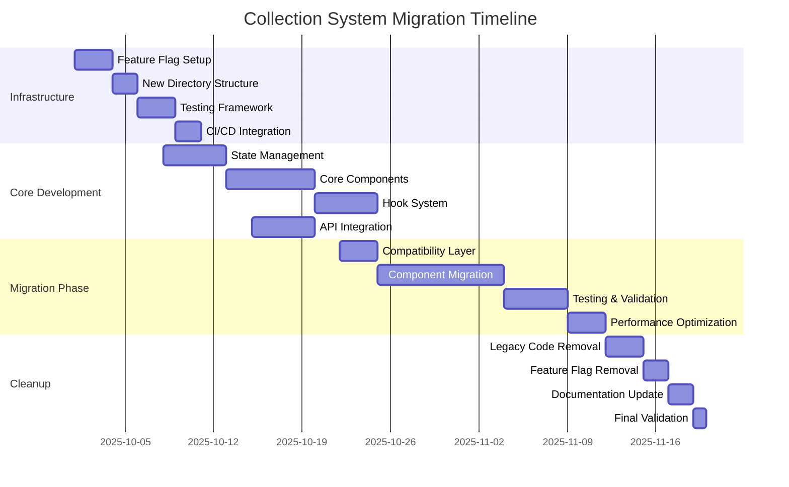

## Phase 1: Infrastructure Setup (Week 1-2)

### 1.1 Feature Flag System Implementation

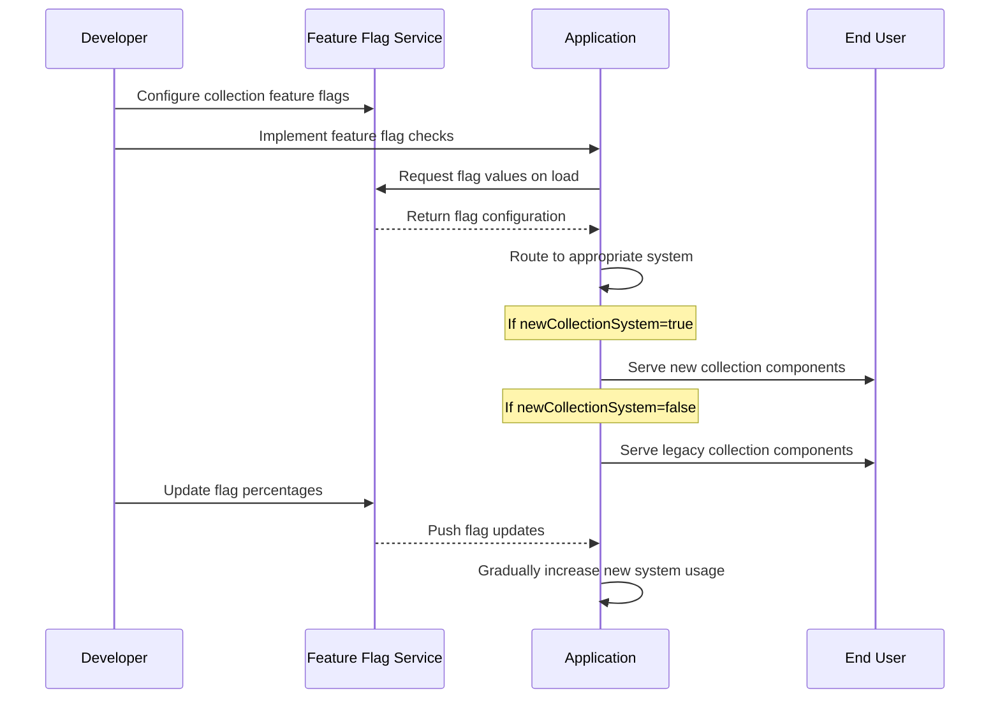

### 1.2 Directory Structure Setup

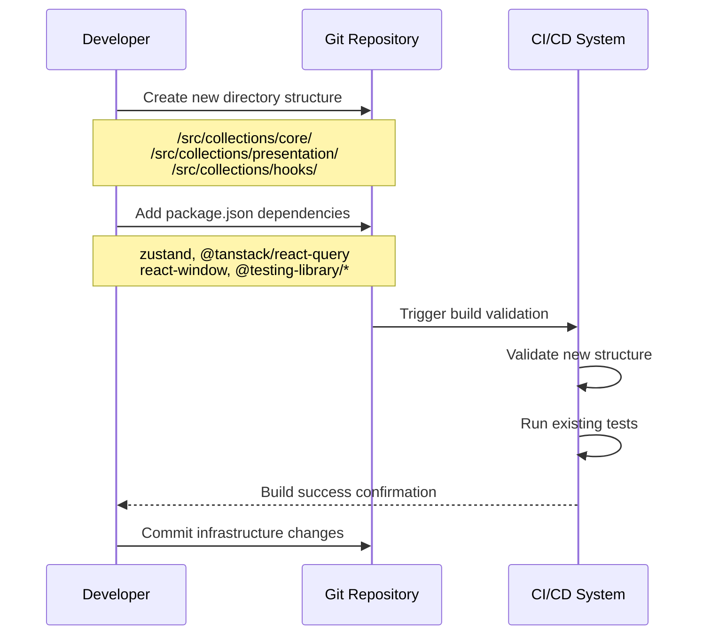

## Phase 2: Core Development (Week 3-5)

### 2.1 State Management Implementation

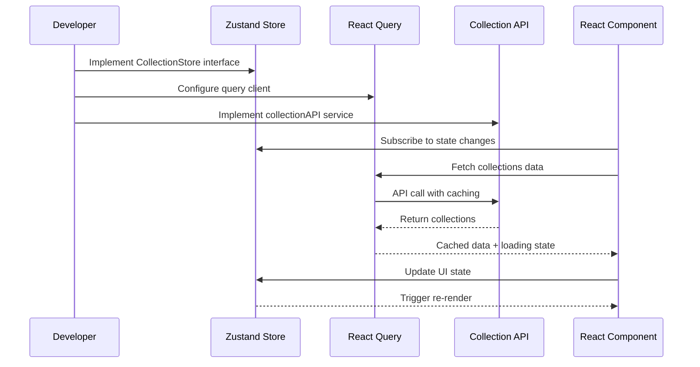

### 2.2 Component Development Sequence

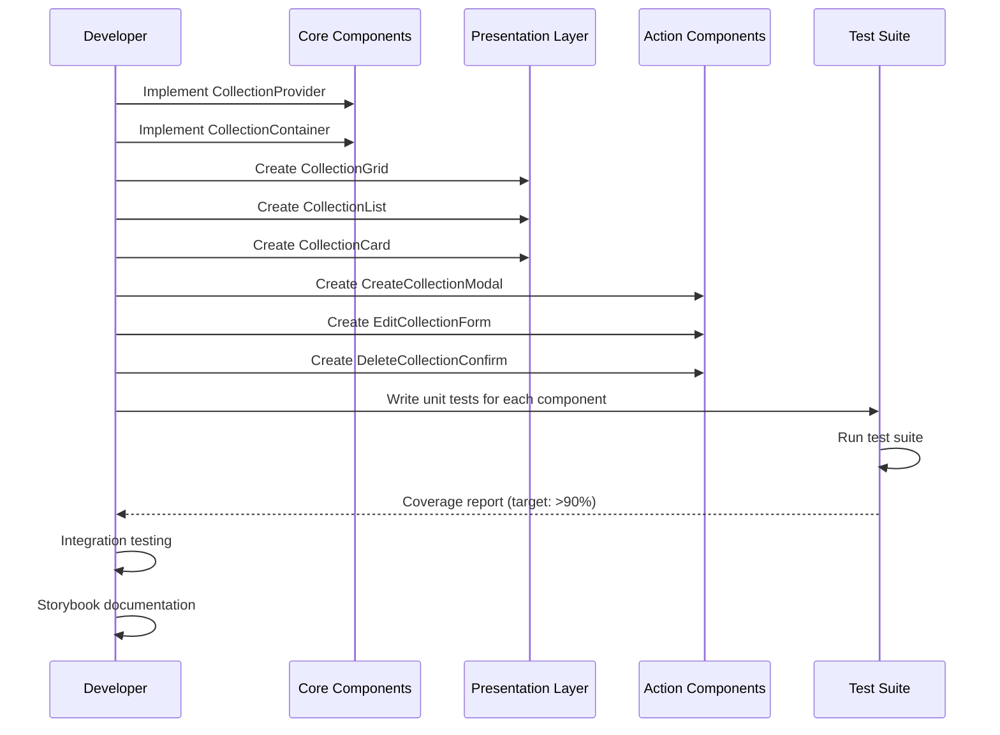

### 2.3 Hook System Development

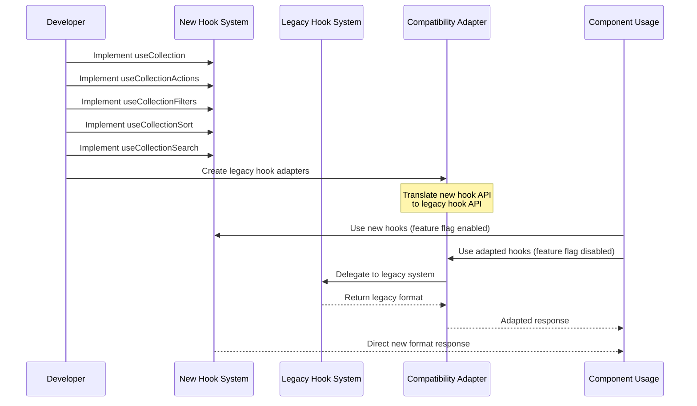

## Phase 3: Migration Phase (Week 6-9)

### 3.1 Gradual Component Migration

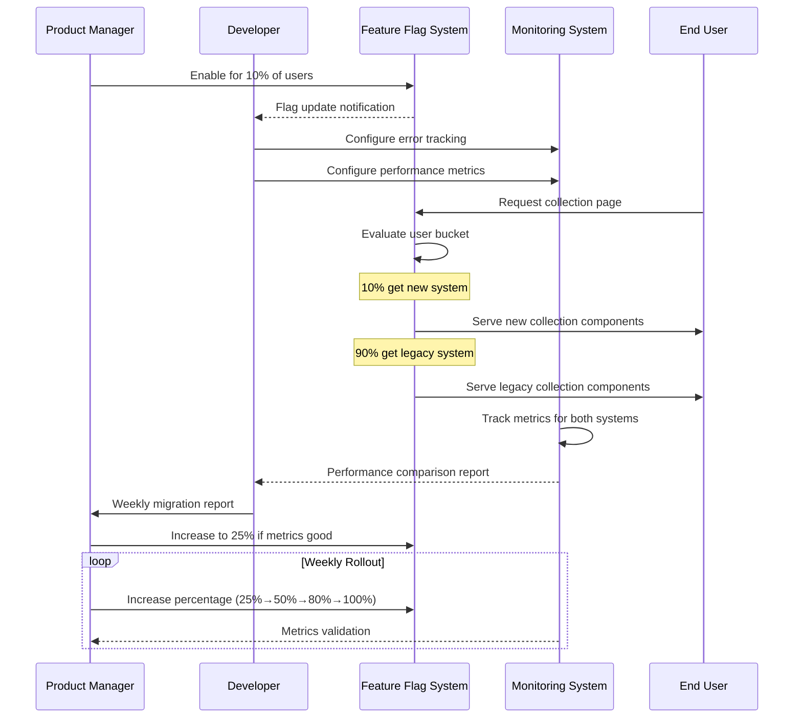

### 3.2 Component-by-Component Migration Strategy

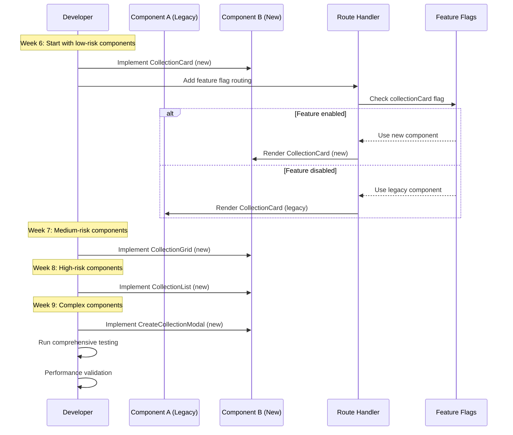

### 3.3 Data Migration and Compatibility

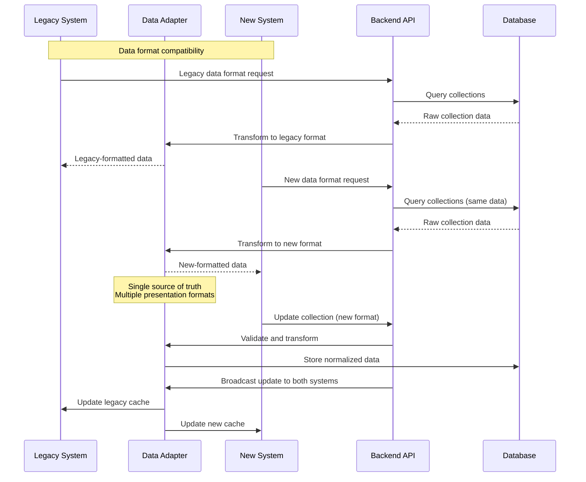

## Phase 4: Cleanup Phase (Week 10)

### 4.1 Legacy Code Removal

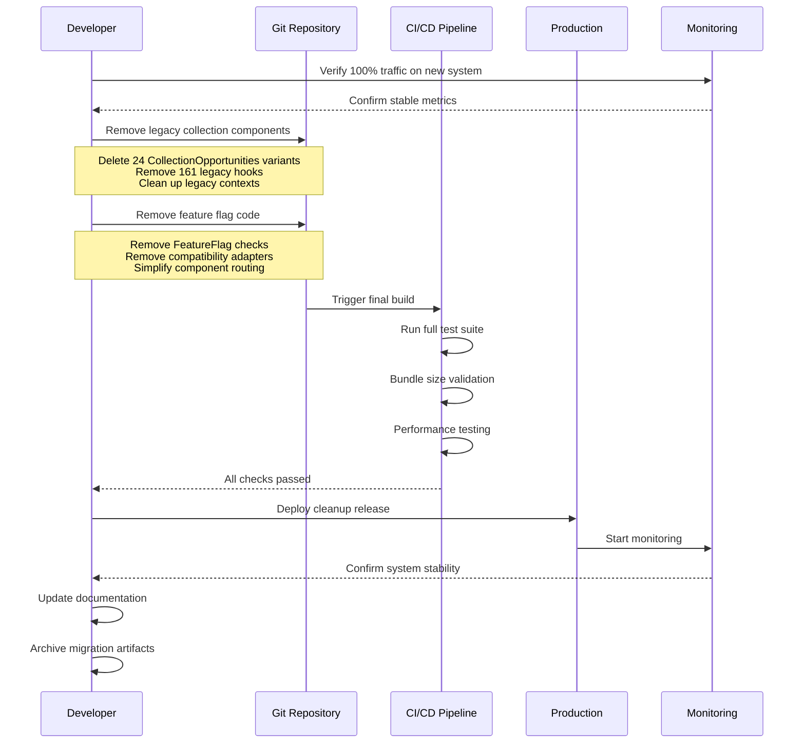

### 4.2 Performance Validation Sequence

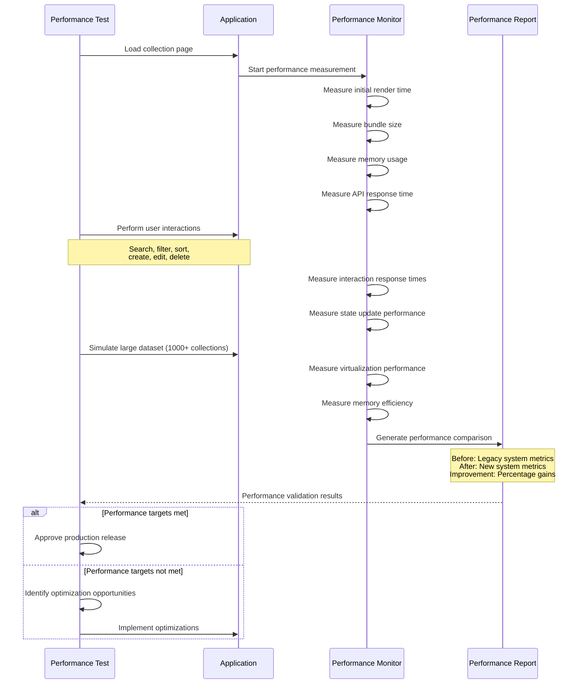

## Error Handling and Rollback Sequences

### Rollback Sequence

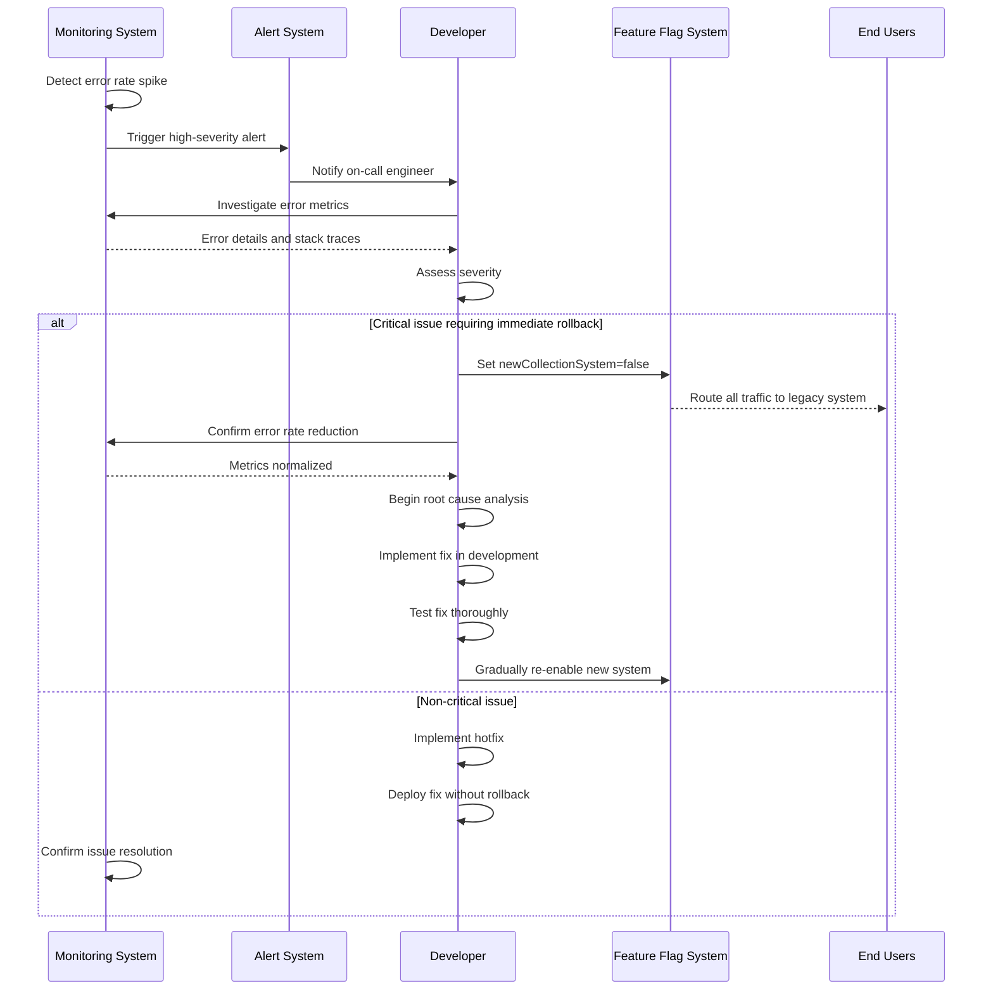

### Migration Health Checks

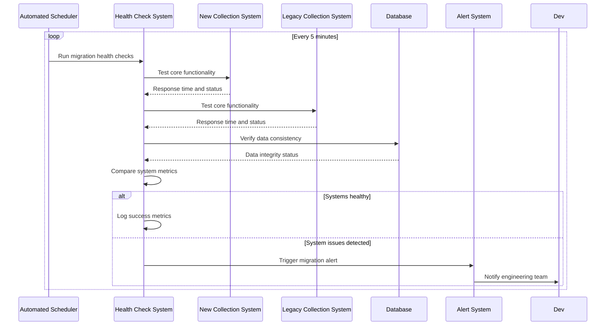

## Success Metrics Tracking

### Performance Metrics Collection

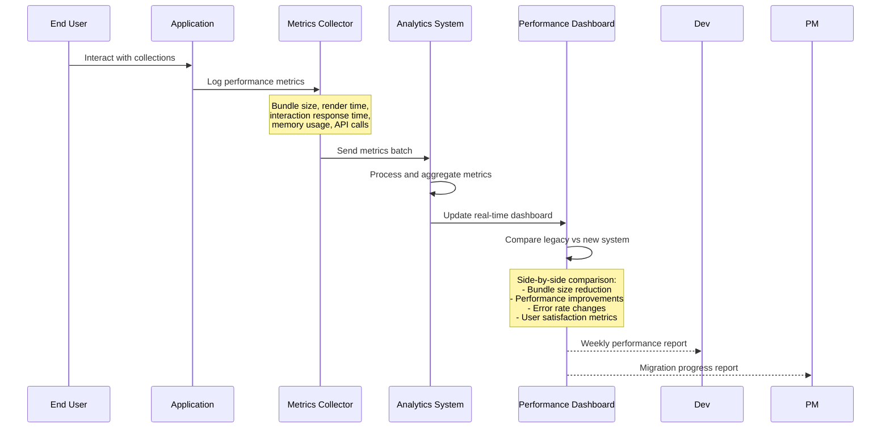

This migration sequence provides a comprehensive roadmap for transitioning from the legacy collection system to the new unified architecture while minimizing risks and ensuring system reliability throughout the process.

---

**Document Version**: 1.0  
**Last Updated**: 2025-09-30  
**Review Date**: 2025-10-07