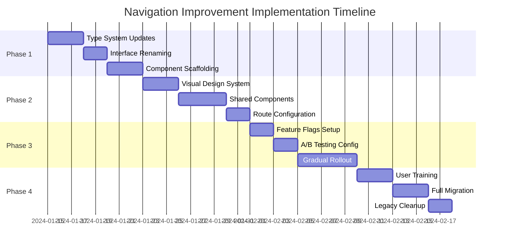

# Navigation Implementation Roadmap

## Executive Summary

This roadmap provides a detailed, phased approach to implementing the navigation and information architecture improvements. The implementation is designed to minimize risk, ensure backward compatibility, and provide measurable progress checkpoints.

## Implementation Timeline



## Phase 1: Foundation (Week 1)

### Day 1-2: Type System Updates

**Task 1.1: Create New Type Definitions**
```typescript
// src/types/navigation.ts
export namespace FieldMapping {
  export interface Result {
    id: string;
    sourceField: string;
    targetField: string;
    confidence: ConfidenceLevel;
    matchType: MatchType;
    status: MappingStatus;
    metadata?: MappingMetadata;
  }
  
  export type ConfidenceLevel = 'high' | 'medium' | 'low';
  export type MatchType = 'exact' | 'fuzzy' | 'semantic' | 'manual';
  export type MappingStatus = 'approved' | 'rejected' | 'pending' | 'modified';
}

export namespace CollectionCreation {
  export interface Opportunity {
    id: string;
    sccNumber: string;
    satelliteInfo: SatelliteInfo;
    collectionDetails: CollectionDetails;
    allocation: AllocationInfo;
    status: OpportunityStatus;
  }
  
  export interface SatelliteInfo {
    priority: number;
    function: string;
    orbit: OrbitType;
  }
}
```

**Task 1.2: Update Existing Interfaces**
```bash
# Create migration script
npm run migrate:types -- --from MatchResult --to FieldMapping.Result
npm run migrate:types -- --from Match --to CollectionCreation.Opportunity
```

### Day 3-4: Component Scaffolding

**Task 1.3: Create Component Structure**
```
src/
├── components/
│   ├── navigation/
│   │   ├── NavigationContext.tsx
│   │   ├── NavigationBreadcrumbs.tsx
│   │   └── ContextualHeader.tsx
│   ├── review/
│   │   ├── UnifiedReviewComponent.tsx
│   │   ├── ReviewTable.tsx
│   │   ├── ReviewFilters.tsx
│   │   └── ReviewActions.tsx
│   └── shared/
│       ├── PageLayout.tsx
│       └── WizardStep.tsx
```

**Task 1.4: Implement Base Components**
```typescript
// Create base components with proper typing
touch src/components/review/UnifiedReviewComponent.tsx
touch src/components/navigation/NavigationContext.tsx
```

## Phase 2: Component Development (Week 2)

### Day 5-7: Visual Design System

**Task 2.1: Create Theme Configuration**
```typescript
// src/theme/reviewThemes.ts
export const reviewThemes = {
  fieldMapping: {
    colors: {
      primary: '#2965CC',
      secondary: '#48AFF0',
      background: '#F7F8FA',
      surface: '#FFFFFF',
      accent: '#0F9960'
    },
    icons: {
      header: IconNames.FLOWS,
      action: IconNames.CONFIRM,
      filter: IconNames.FILTER
    }
  },
  collectionOpportunity: {
    colors: {
      primary: '#0F9960',
      secondary: '#3DCC91',
      background: '#F7FAF5',
      surface: '#FFFFFF',
      accent: '#2965CC'
    },
    icons: {
      header: IconNames.SATELLITE,
      action: IconNames.SELECTION,
      filter: IconNames.GLOBE_NETWORK
    }
  }
};
```

**Task 2.2: Implement Styled Components**
```bash
# Install dependencies
npm install styled-components @types/styled-components

# Create styled components
touch src/components/review/ReviewStyles.tsx
```

### Day 8-10: Shared Component Implementation

**Task 2.3: Build Unified Review Component**
```typescript
// Implementation checklist:
// [ ] Props interface with generics
// [ ] Mode-based theming
// [ ] Column configuration
// [ ] Selection handling
// [ ] Action callbacks
// [ ] Filter integration
// [ ] Accessibility features
```

**Task 2.4: Create Mode-Specific Wrappers**
```typescript
// src/pages/FieldMappingReview.tsx
export const FieldMappingReview = () => {
  // [ ] Implement with UnifiedReviewComponent
  // [ ] Add field mapping specific logic
  // [ ] Connect to state management
};

// src/pages/CreateCollectionDeck/Step3SelectOpportunities.tsx
export const Step3SelectOpportunities = () => {
  // [ ] Implement with UnifiedReviewComponent
  // [ ] Add opportunity selection logic
  // [ ] Integrate with wizard context
};
```

## Phase 3: Integration & Testing (Week 3)

### Day 11-12: Route Configuration

**Task 3.1: Update Router Configuration**
```typescript
// src/App.tsx
const router = createBrowserRouter([
  {
    path: "/",
    element: <Root />,
    children: [
      {
        path: "history",
        element: <History />,
      },
      {
        path: "history/:collectionId/field-mapping-review",
        element: <FieldMappingReview />,
        loader: fieldMappingLoader,
      },
      {
        path: "create-collection-deck",
        element: <CreateCollectionDeckWizard />,
        children: [
          { index: true, element: <Navigate to="data" /> },
          { path: "data", element: <Step1InputData /> },
          { path: "parameters", element: <Step2ReviewParameters /> },
          { 
            path: "collection-opportunities", 
            element: <Step3SelectOpportunities /> 
          },
          { path: "instructions", element: <Step4SpecialInstructions /> },
        ],
      },
    ],
  },
]);
```

**Task 3.2: Implement Route Guards**
```typescript
// src/utils/routeGuards.ts
export const collectionContextGuard = (
  request: Request,
  context: LoaderFunctionArgs
) => {
  const { state } = context.location;
  if (!state?.collectionId) {
    throw redirect("/history");
  }
  return null;
};
```

### Day 13-14: Feature Flag Setup

**Task 3.3: Configure Feature Flags**
```typescript
// src/config/featureFlags.ts
export const featureFlags = {
  navigation: {
    unifiedReview: {
      enabled: process.env.REACT_APP_UNIFIED_REVIEW === 'true',
      rolloutPercentage: 10,
      userGroups: ['beta', 'internal']
    }
  }
};

// Usage
const NavigationWrapper = () => {
  const isUnifiedReviewEnabled = useFeatureFlag('navigation.unifiedReview');
  
  return isUnifiedReviewEnabled ? (
    <UnifiedReviewComponent />
  ) : (
    <LegacyMatchReview />
  );
};
```

### Day 15-17: Testing Implementation

**Task 3.4: Unit Tests**
```typescript
// src/components/review/__tests__/UnifiedReviewComponent.test.tsx
describe('UnifiedReviewComponent', () => {
  it('should render field mapping mode correctly', () => {
    // Test field mapping specific rendering
  });
  
  it('should render collection opportunity mode correctly', () => {
    // Test collection opportunity specific rendering
  });
  
  it('should handle selection changes', () => {
    // Test selection logic
  });
});
```

**Task 3.5: E2E Tests**
```typescript
// cypress/e2e/navigation-clarity.cy.ts
describe('Navigation Clarity', () => {
  it('should maintain clear context in field mapping review', () => {
    cy.visit('/history');
    cy.get('[data-testid="collection-row"]').first().click();
    cy.get('[data-testid="view-field-mappings"]').click();
    
    cy.get('[data-testid="page-title"]')
      .should('contain', 'Field Mapping Review');
    cy.get('[data-testid="context-icon"]')
      .should('have.attr', 'data-icon', 'flows');
  });
});
```

## Phase 4: Rollout & Migration (Week 4)

### Day 18-19: User Training Materials

**Task 4.1: Create Documentation**
```markdown
# Navigation Updates Guide

## What's Changed

### Field Mapping Review (formerly "Match Review")
- Located under History → Collection Results
- Reviews data field relationships
- Blue theme with flow icons

### Collection Opportunity Selection (formerly "Review Matches")
- Part of Collection Deck creation wizard
- Select satellite passes
- Green theme with satellite icons
```

**Task 4.2: In-App Guidance**
```typescript
// src/components/onboarding/NavigationTour.tsx
const tourSteps = [
  {
    target: '.field-mapping-header',
    content: 'Field Mapping Review shows how your data fields connect',
    placement: 'bottom'
  },
  {
    target: '.opportunity-selection-header',
    content: 'Collection Opportunities lets you select satellite passes',
    placement: 'bottom'
  }
];
```

### Day 20-22: Gradual Rollout

**Task 4.3: Implement A/B Testing**
```typescript
// src/utils/abTesting.ts
export const NavigationABTest = {
  id: 'unified-navigation-v1',
  variants: {
    control: { weight: 90 },
    treatment: { weight: 10 }
  },
  metrics: [
    'navigation_success_rate',
    'time_to_complete_task',
    'user_confusion_events'
  ]
};
```

**Task 4.4: Monitor Metrics**
```typescript
// src/analytics/navigationMetrics.ts
export const trackNavigationEvent = (event: NavigationEvent) => {
  analytics.track('navigation_event', {
    from: event.from,
    to: event.to,
    context: event.context,
    success: event.success,
    duration: event.duration
  });
};
```

## Rollback Plan

### Criteria for Rollback
1. Navigation success rate drops below 85%
2. Support ticket volume increases by >50%
3. Critical bugs in production
4. User satisfaction score drops below 3.5/5

### Rollback Procedure
```bash
# 1. Disable feature flag
npm run feature:disable navigation.unifiedReview

# 2. Revert to previous version
git revert --no-commit HEAD~5..HEAD
git commit -m "Revert: Navigation improvements due to [REASON]"

# 3. Deploy hotfix
npm run deploy:hotfix

# 4. Communicate to users
npm run notify:users "Navigation temporarily reverted"
```

## Success Metrics & Monitoring

### Key Performance Indicators
```typescript
// src/monitoring/navigationKPIs.ts
export const navigationKPIs = {
  primary: {
    navigationSuccessRate: {
      target: 95,
      current: () => getMetric('nav_success_rate'),
      alert: 85
    },
    taskCompletionTime: {
      target: 180, // seconds
      current: () => getMetric('task_completion_avg'),
      alert: 300
    }
  },
  secondary: {
    supportTickets: {
      target: 10, // per week
      current: () => getMetric('nav_support_tickets'),
      alert: 20
    },
    userSatisfaction: {
      target: 4.5,
      current: () => getMetric('nav_satisfaction_score'),
      alert: 3.5
    }
  }
};
```

### Monitoring Dashboard
```typescript
// Configure monitoring alerts
const alerts = [
  {
    name: 'NavigationConfusion',
    condition: 'nav_confusion_events > 10 per hour',
    action: 'notify-team'
  },
  {
    name: 'NavigationPerformance',
    condition: 'nav_load_time > 2000ms',
    action: 'investigate'
  }
];
```

## Post-Implementation Tasks

### Week 5: Optimization
1. Performance tuning based on metrics
2. Accessibility improvements
3. Mobile responsiveness enhancements

### Week 6: Documentation & Training
1. Update user documentation
2. Create video tutorials
3. Internal team training

### Week 7: Full Deprecation
1. Remove legacy components
2. Clean up feature flags
3. Archive old code

## Risk Mitigation

### Technical Risks
- **Risk**: Performance regression
- **Mitigation**: Implement virtualization early, profile regularly

### User Experience Risks
- **Risk**: User confusion during transition
- **Mitigation**: Clear communication, in-app guidance, gradual rollout

### Business Risks
- **Risk**: Reduced productivity during transition
- **Mitigation**: Maintain parallel systems, quick rollback capability