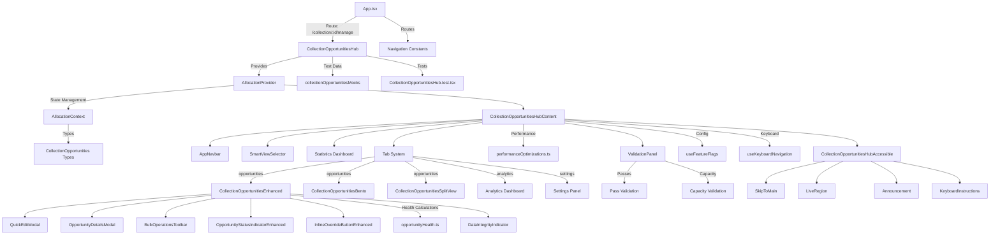

# Collection Management Ecosystem Architecture

## Overview

The CollectionOpportunitiesHub serves as the central orchestration point for satellite collection opportunity management in the Malibu application. This document provides a comprehensive mapping of the entire collection management ecosystem, including all components, data flows, integrations, and dependencies.

## System Architecture Diagram



## Component Hierarchy

### 1. Core Hub Structure

```
CollectionOpportunitiesHub (pages/CollectionOpportunitiesHub.tsx)
├── AppNavbar
├── AllocationProvider
│   └── CollectionOpportunitiesHubContent
│       ├── SkipToMain (Accessibility)
│       ├── KeyboardInstructions
│       ├── Header Section
│       │   ├── Title & Status
│       │   ├── Quick Actions Bar
│       │   └── Hub Actions (Commit/Rollback)
│       ├── SmartViewSelector
│       ├── Statistics Dashboard
│       │   ├── Total Opportunities
│       │   ├── Critical Issues
│       │   ├── Warnings
│       │   ├── Optimal
│       │   ├── Pending Changes
│       │   └── System Health
│       ├── Tab System
│       │   ├── Manage Opportunities
│       │   ├── Analytics
│       │   └── Settings
│       ├── ReallocationWorkspace (Modal)
│       └── Status Bar
```

### 2. Data Management Layer

```
AllocationContext (contexts/AllocationContext.tsx)
├── State Structure
│   ├── opportunities: CollectionOpportunity[]
│   ├── availableSites: Site[]
│   ├── collectionDecks: CollectionDeck[]
│   ├── availablePasses: Map<string, Pass[]>
│   ├── healthScores: Map<string, OpportunityHealth>
│   ├── pendingChanges: Map<string, OpportunityChange>
│   ├── selectedOpportunities: Set<string>
│   └── webSocketConnected: boolean
├── Actions
│   ├── SET_OPPORTUNITIES
│   ├── UPDATE_OPPORTUNITY
│   ├── BATCH_UPDATE_OPPORTUNITIES
│   ├── COMMIT_CHANGES
│   ├── ROLLBACK_CHANGES
│   └── UPDATE_HEALTH_SCORES
└── Helper Methods
    ├── updateOpportunity()
    ├── batchUpdateOpportunities()
    ├── commitChanges()
    ├── rollbackChanges()
    └── refreshHealthScores()
```

## Key Data Types

### CollectionOpportunity
- **Core Fields**: id, name, satellite, sites, priority, status
- **Capacity**: capacityPercentage, capacity
- **Matching**: matchStatus, matchNotes, matchQuality
- **Validation**: passes, dataIntegrityIssues
- **Metadata**: createdDate, lastModified, modifiedBy

### Site
- **Identification**: id, name
- **Location**: lat, lon coordinates
- **Capacity**: capacity, allocated

### Pass
- **Timing**: startTime, endTime, duration
- **Quality**: quality (1-5), elevation, azimuth
- **Resources**: siteCapabilities, requiredResources
- **Metadata**: satellite, sensor, groundStation

### OpportunityHealth
- **Status**: level (optimal/warning/critical)
- **Metrics**: capacityScore, matchQuality, conflictCount
- **Analysis**: reasons[], recommendations[]
- **Score**: 0-100 overall health score

## Major Component Dependencies

### CollectionOpportunitiesEnhanced
**Purpose**: Main data grid with advanced features
**Dependencies**:
- @blueprintjs/table for data grid
- OpportunityHealth utilities
- QuickEditModal for inline editing
- BulkOperationsToolbar for batch operations
- OpportunityDetailsModal for detailed view
- DataIntegrityIndicator for data quality

### SmartViewSelector
**Purpose**: Pre-configured filters for common views
**Views**:
- All Opportunities
- My Sensors
- Needs Review
- Critical Issues
- Unmatched
- Needs Validation

### ValidationPanel
**Purpose**: Multi-step validation workflow
**Steps**:
1. Pass Verification
2. Capacity Validation
3. Conflict Resolution
4. Approval/Rejection

### Performance Optimizations
**Utilities**:
- usePerformanceMonitor: Component render monitoring
- useDebouncedFilter: Search optimization
- useBatchedUpdates: Reduce re-renders
- useVirtualScroll: Large dataset handling
- useLazyLoad: Component lazy loading

## Data Flow Patterns

### 1. Initial Load
```
App → Route → CollectionOpportunitiesHub
→ Load Mock Data (Dev) or API (Prod)
→ AllocationProvider initialization
→ CollectionOpportunitiesHubContent render
→ Calculate Health Scores
→ Display UI
```

### 2. Opportunity Update
```
User Action → Dispatch UPDATE_OPPORTUNITY
→ Update workingData
→ Add to pendingChanges
→ Recalculate Health Scores
→ Update UI with change indicators
→ Enable Commit/Rollback buttons
```

### 3. Validation Flow
```
Select Opportunity → Open ValidationPanel
→ Verify Passes → Check Capacity
→ Resolve Conflicts → Generate Summary
→ Approve/Reject → Update Status
```

### 4. Batch Operations
```
Select Multiple → Choose Operation
→ Preview Changes → Confirm
→ Apply Updates → Add to Undo Stack
→ Update Audit Trail → Refresh View
```

## Feature Flag Configuration

```typescript
{
  progressiveComplexityUI: boolean,    // Use enhanced UI
  enableVirtualScrolling: boolean,     // Large dataset optimization
  enableWorkspaceMode: boolean,        // Reallocation workspace
  enableBatchOperations: boolean,      // Bulk updates
  enableHealthAnalysis: boolean,       // Health scoring
  useRefactoredComponents: boolean,    // New component versions
  enableSplitView: boolean,            // Split view layout
  enableBentoLayout: boolean,          // Bento grid layout
  enableEnhancedBento: boolean         // Enhanced bento features
}
```

## Testing Infrastructure

### Unit Tests
- Component rendering tests
- State management tests
- Utility function tests
- Mock data validation

### Integration Tests
- Tab navigation
- Data flow validation
- Feature flag behavior
- Error handling

### E2E Tests
- Full workflow validation
- Performance monitoring
- Accessibility compliance

## Navigation & Routing

### Routes
- `/collection/:collectionId/manage` - Main hub
- `/history` - Navigation back target
- Internal tab navigation (no route changes)

### Keyboard Shortcuts
- `Cmd/Ctrl + E` - Edit selected
- `Cmd/Ctrl + R` - Reallocate selected
- `Cmd/Ctrl + S` - Save changes
- `Escape` - Clear selection
- `?` - Show shortcuts help

## Accessibility Features

### ARIA Implementation
- Proper landmarks (main, banner, contentinfo)
- Live regions for announcements
- Descriptive labels for all controls
- Screen reader optimized tables
- Skip navigation links

### Keyboard Navigation
- Full keyboard accessibility
- Focus management
- Shortcut documentation
- Tab trapping in modals

## Performance Considerations

### Optimization Strategies
1. **Component Memoization**: React.memo on expensive components
2. **Lazy Loading**: Code splitting for large components
3. **Virtual Scrolling**: For large datasets
4. **Debounced Search**: 300ms delay
5. **Batch Updates**: Reduce re-renders
6. **Health Score Caching**: Memoized calculations

### Resource Management
- Token usage monitoring
- Memory efficient data structures
- Cleanup on unmount
- WebSocket connection management

## Security Considerations

### Data Protection
- Mock data only in development
- Secure WebSocket connections
- Input validation on all forms
- XSS prevention in rendered content

### Access Control
- Classification level support
- User-specific sensor filtering
- Audit trail for all changes

## Future Extensibility

### Extension Points
1. **Custom Views**: Add new SmartView filters
2. **New Validations**: Extend ValidationPanel
3. **Additional Metrics**: Enhance health calculations
4. **Custom Actions**: Add to action menu
5. **New Visualizations**: Alternative view modes

### Integration Points
- WebSocket for real-time updates
- External API for data persistence
- Analytics service integration
- Export/Import capabilities

## Dependencies Summary

### Core Dependencies
- React 18+ with Hooks
- React Router v6
- Blueprint.js v6
- TypeScript 4.5+

### Utility Libraries
- lodash (debounce, throttle)
- Performance monitoring
- Intersection Observer API

### Development Dependencies
- Jest & React Testing Library
- Mock data generators
- TypeScript types

## Maintenance Guidelines

### Code Organization
- Components in dedicated folders
- Shared types in types/
- Utilities in utils/
- Context providers in contexts/
- Tests alongside components

### Best Practices
1. Use TypeScript strict mode
2. Implement proper error boundaries
3. Follow accessibility guidelines
4. Maintain test coverage >80%
5. Document complex algorithms
6. Use meaningful commit messages

This architecture document should be updated whenever significant changes are made to the collection management ecosystem.