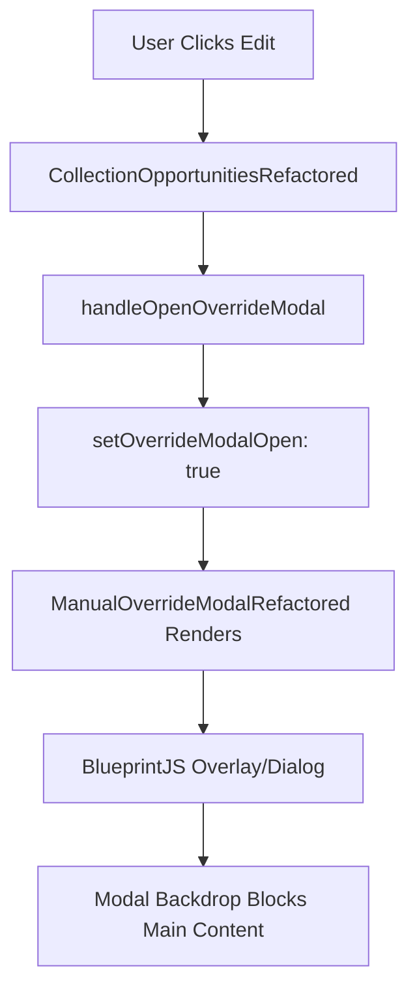
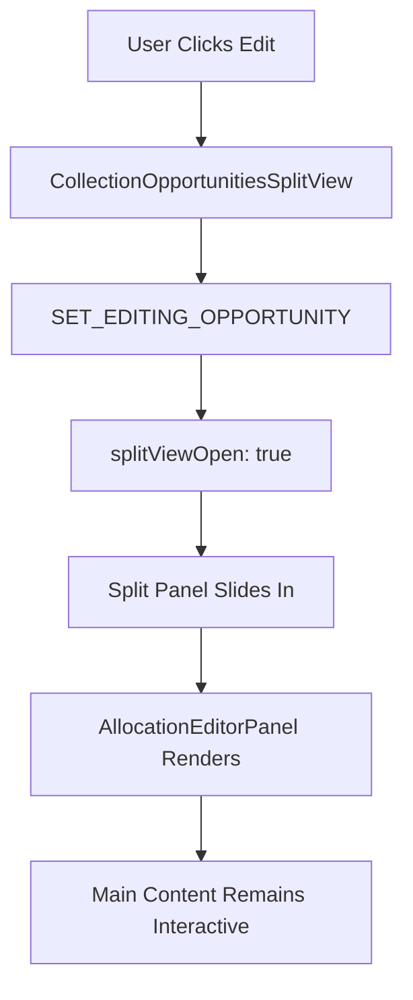

# Split View Implementation Status

## Current State (❌ Modal-Based)



### Evidence:
- Component: `CollectionOpportunitiesRefactored`
- Modal State: `overrideModalOpen`
- Modal Component: `ManualOverrideModalRefactored`
- Behavior: Full-screen overlay blocks interaction

## Expected State (✅ Split View)



### Expected Features:
- Component: `CollectionOpportunitiesSplitView`
- Split View State: `splitViewOpen`
- Editor Component: `AllocationEditorPanel`
- Behavior: Side panel, main content accessible

## Implementation Gap

| Feature | Modal (Current) | Split View (Expected) | Status |
|---------|----------------|----------------------|---------|
| Component Import | ✅ Imported & Used | ❌ Not Imported | 🔴 Gap |
| Feature Flag | ✅ useRefactoredComponents | ❌ No Flag | 🔴 Gap |
| User Experience | Blocking Overlay | Side Panel | 🔴 Gap |
| Main Content Access | ❌ Blocked | ✅ Accessible | 🔴 Gap |
| Resize Capability | ❌ Fixed Modal | ✅ Resizable Panel | 🔴 Gap |
| Keyboard Navigation | Limited | Enhanced | 🔴 Gap |
| Mobile Experience | Full Screen Modal | Responsive Panel | 🔴 Gap |

## Quick Fix Guide

### Step 1: Add Feature Flag
```typescript
// In useFeatureFlags.tsx
useSplitView: boolean;
```

### Step 2: Import Component
```typescript
// In CollectionOpportunitiesHub.tsx
import { CollectionOpportunitiesSplitView } from '../components/CollectionOpportunitiesSplitView';
```

### Step 3: Update Rendering Logic
```typescript
// In CollectionOpportunitiesHub.tsx
{useSplitView ? (
  <CollectionOpportunitiesSplitView />
) : useRefactoredComponents ? (
  <CollectionOpportunitiesRefactored />
) : ...}
```

### Step 4: Enable Feature
```typescript
// In defaultFlags
useSplitView: true
```

## Test Readiness

✅ **All E2E Tests Created**
- `split-view-modal-replacement.spec.ts` - Comprehensive verification suite
- `modal-vs-split-view-verification.spec.ts` - Implementation checker
- Visual regression tests for all breakpoints
- Performance measurement framework
- Cross-browser test configuration

⏳ **Waiting For**: Component activation to run full test suite